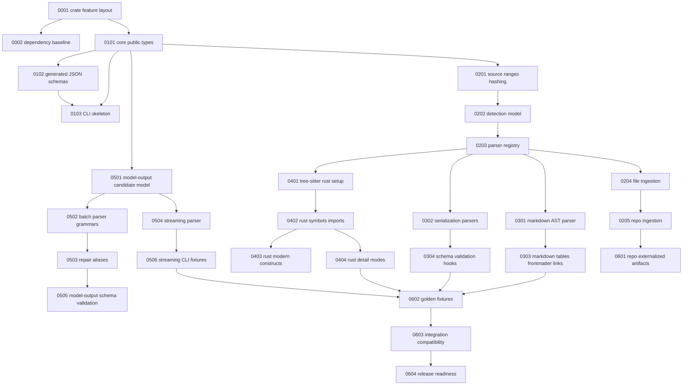

# Grist Ticket Index

This directory decomposes `docs/spec.md` into implementation tickets grouped by epoch.

## Epochs

- [Epoch 0 — Foundation](epoch-0-foundation/)
- [Epoch 1 — Contracts, schemas, and CLI skeleton](epoch-1-contracts-cli/)
- [Epoch 2 — Ingestion and detection](epoch-2-ingestion-detection/)
- [Epoch 3 — Markdown and serialization](epoch-3-document-serialization/)
- [Epoch 4 — Rust ingestion](epoch-4-rust-ingestion/)
- [Epoch 5 — Model-output parsing](epoch-5-model-output/)
- [Epoch 6 — Hardening and integration](epoch-6-hardening-integration/)

## Dependency graph

## Ticket list

### Epoch 0 — Foundation

- [0001 — Establish crate module and feature layout](epoch-0-foundation/0001-crate-feature-layout.md)
- [0002 — Add initial dependency baseline](epoch-0-foundation/0002-dependency-baseline.md)

### Epoch 1 — Contracts, schemas, and CLI skeleton

- [0101 — Define core public contract types](epoch-1-contracts-cli/0101-core-public-types.md)
- [0102 — Implement generated JSON Schema workflow](epoch-1-contracts-cli/0102-generated-json-schema-workflow.md)
- [0103 — Add JSON-only CLI skeleton](epoch-1-contracts-cli/0103-json-cli-skeleton.md)

### Epoch 2 — Ingestion and detection

- [0201 — Implement source ranges, hashes, and provenance](epoch-2-ingestion-detection/0201-source-ranges-hashes-provenance.md)
- [0202 — Implement content detection and file classification](epoch-2-ingestion-detection/0202-content-detection-file-classification.md)
- [0203 — Implement internal parser registry](epoch-2-ingestion-detection/0203-parser-registry.md)
- [0204 — Implement file ingestion API](epoch-2-ingestion-detection/0204-file-ingestion-api.md)
- [0205 — Implement repo ingestion API](epoch-2-ingestion-detection/0205-repo-ingestion-api.md)

### Epoch 3 — Markdown and serialization

- [0301 — Implement Markdown AST parser](epoch-3-document-serialization/0301-markdown-ast-parser.md)
- [0302 — Implement JSON, JSONL, YAML, and TOML parsers](epoch-3-document-serialization/0302-serialization-parsers.md)
- [0303 — Complete Markdown tables, links, fences, and frontmatter](epoch-3-document-serialization/0303-markdown-structures.md)
- [0304 — Implement schema validation hooks](epoch-3-document-serialization/0304-schema-validation-hooks.md)

### Epoch 4 — Rust ingestion

- [0401 — Set up tree-sitter Rust parser](epoch-4-rust-ingestion/0401-tree-sitter-rust-setup.md)
- [0402 — Extract Rust symbols, imports, and ranges](epoch-4-rust-ingestion/0402-rust-symbols-imports-ranges.md)
- [0403 — Cover modern Rust constructs](epoch-4-rust-ingestion/0403-modern-rust-constructs.md)
- [0404 — Add Rust parser detail modes](epoch-4-rust-ingestion/0404-rust-detail-modes.md)

### Epoch 5 — Model-output parsing

- [0501 — Define model-output candidate and event model](epoch-5-model-output/0501-candidate-event-model.md)
- [0502 — Implement batch model-output grammars](epoch-5-model-output/0502-batch-grammars.md)
- [0503 — Implement repair and alias rule engine](epoch-5-model-output/0503-repair-alias-rule-engine.md)
- [0504 — Implement streaming parser](epoch-5-model-output/0504-streaming-parser.md)
- [0505 — Add model-output schema validation integration](epoch-5-model-output/0505-schema-validation-integration.md)
- [0506 — Add model-output CLI and streaming fixtures](epoch-5-model-output/0506-cli-streaming-fixtures.md)

### Epoch 6 — Hardening and integration

- [0601 — Add externalized repo artifact mode](epoch-6-hardening-integration/0601-externalized-repo-artifacts.md)
- [0602 — Build golden fixture and regression test matrix](epoch-6-hardening-integration/0602-golden-fixture-regression-matrix.md)
- [0603 — Validate Bathysphere, graph-composer, and research-chain compatibility](epoch-6-hardening-integration/0603-integration-compatibility.md)
- [0604 — Release readiness hardening](epoch-6-hardening-integration/0604-release-readiness.md)
